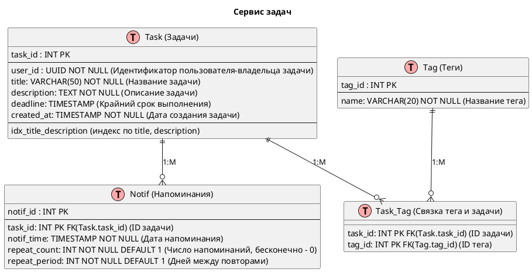

```plantuml
@startuml

!define Table(name,desc) entity name as "desc" << (T,#FFAAAA) >>
title Сервис задач

Table(Task, "Task (Задачи)") {
  task_id : INT PK
  --
  user_id : UUID NOT NULL (Идентификатор пользователя-владельца задачи)
  title: VARCHAR(50) NOT NULL (Название задачи)
  description: TEXT NOT NULL (Описание задачи)
  deadline: TIMESTAMP (Крайний срок выполнения)
  created_at: TIMESTAMP NOT NULL (Дата создания задачи)
  --
  idx_title_description (индекс по title, description)
}

Table(Tag, "Tag (Теги)") {
  tag_id : INT PK
  --
  name: VARCHAR(20) NOT NULL (Название тега)
}

Table(Task_Tag, "Task_Tag (Связка тега и задачи)") {
  task_id: INT PK FK(Task.task_id) (ID задачи)
  tag_id: INT PK FK(Tag.tag_id) (ID тега)
}

Table(Notif, "Notif (Напоминания)") {
  notif_id : INT PK
  --
  task_id: INT PK FK(Task.task_id) (ID задачи)
  notif_time: TIMESTAMP NOT NULL (Дата напоминания)
  repeat_count: INT NOT NULL DEFAULT 1 (Число напоминаний, бесконечно - 0)
  repeat_period: INT NOT NULL DEFAULT 1 (Дней между повторами)
}

Task ||--o{ Task_Tag : "1:M"
Tag ||--o{ Task_Tag : "1:M"
Task ||--o{ Notif : "1:M"
@enduml
```
