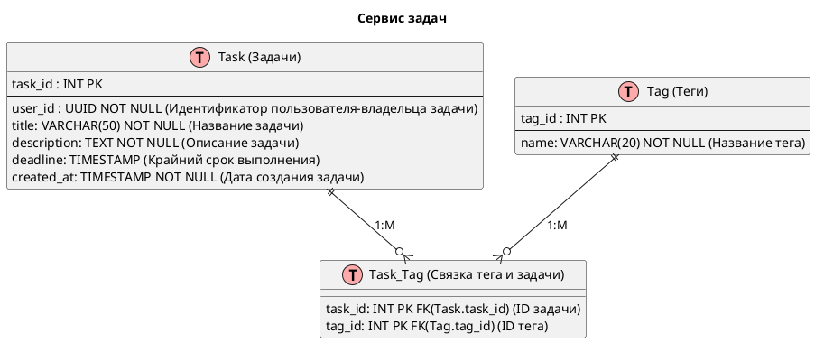

```plantuml
@startuml

!define Table(name,desc) entity name as "desc" << (T,#FFAAAA) >>
title Сервис задач

Table(Task, "Task (Задачи)") {
  task_id : INT PK
  --
  user_id : UUID NOT NULL (Идентификатор пользователя-владельца задачи)
  title: VARCHAR(50) NOT NULL (Название задачи)
  description: TEXT NOT NULL (Описание задачи)
  deadline: TIMESTAMP (Крайний срок выполнения)
  created_at: TIMESTAMP NOT NULL (Дата создания задачи)
}

Table(Tag, "Tag (Теги)") {
  tag_id : INT PK
  --
  name: VARCHAR(20) NOT NULL (Название тега)
}

Table(Task_Tag, "Task_Tag (Связка тега и задачи)") {
  task_id: INT PK FK(Task.task_id) (ID задачи)
  tag_id: INT PK FK(Tag.tag_id) (ID тега)
}

Task ||--o{ Task_Tag : "1:M"
Tag ||--o{ Task_Tag : "1:M"
@enduml
```
